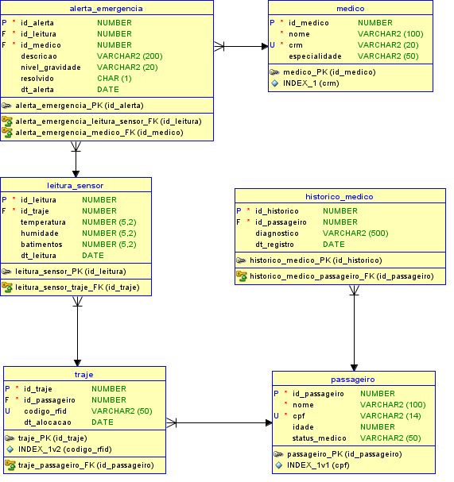

# 🚀 StellarGear API 🛰️

## 🌌 Global Solution 2026/1 - FIAP

### Tema: Economia Espacial e Saúde 

---

# 👨‍🚀 Integrantes

| Nome                   | RM     |
| ---------------------- | ------ |
| Enzo Vaz               | 561702 |
| Lucas Ryuji Fukuda     | 562152 |
| Pietro Donella Salomão | 561722 |

### 🎓 Turma

**2TDSPF**

---

# 📖 Sobre o Projeto

O **StellarGear** é uma plataforma desenvolvida para monitoramento de saúde e gestão inteligente de equipamentos em missões espaciais e turismo orbital.

A solução foi construída utilizando **.NET 10** e seguindo os princípios da **Clean Architecture**, garantindo:

* ✅ Separação de responsabilidades
* ✅ Alta escalabilidade
* ✅ Facilidade de manutenção
* ✅ Código limpo e organizado
* ✅ Baixo acoplamento entre camadas

A API realiza o gerenciamento de:

* 👨‍🚀 Passageiros
* 🩺 Médicos
* 🧑‍🚀 Trajes espaciais
* 📡 Leituras de sensores
* 🚨 Alertas de emergência
* 📋 Histórico médico

---

# 🏗️ Arquitetura da Solução

O projeto segue o padrão **Clean Architecture**, dividido nas seguintes camadas:

## 1️⃣ Domain

Responsável pelas entidades de negócio e contratos da aplicação.

### Entidades:

* Passageiro
* Medico
* Traje
* LeituraSensor
* AlertaEmergencia
* HistoricoMedico

### Contém:

* Regras de negócio
* Interfaces de repositórios
* Entidades do domínio

---

## 2️⃣ Application

Responsável pela comunicação de dados entre as camadas.

### Contém:

* DTOs (Data Transfer Objects)
* Validações
* Regras de aplicação

---

## 3️⃣ Infrastructure

Responsável pelo acesso aos dados e integração com banco Oracle.

### Contém:

* Entity Framework Core
* DbContext
* Implementações dos repositórios
* Configuração de persistência

---

## 4️⃣ API

Responsável pela exposição dos endpoints REST.

### Contém:

* Controllers RESTful
* Swagger
* Injeção de dependência
* Configuração da aplicação

---

# 📊 Diagrama

## 🗄️ Diagrama Entidade-Relacionamento (DER)

### Relacionamentos principais:

* `Passageiro` (1) → (N) `Traje`
* `Traje` (1) → (N) `LeituraSensor`
* `LeituraSensor` (1) → (1) `AlertaEmergencia`
* `Medico` (1) → (N) `AlertaEmergencia`



---

# ⚙️ Tecnologias Utilizadas

* .NET 10
* ASP.NET Core Web API
* Entity Framework Core
* Oracle Database
* Swagger / Swashbuckle
* Clean Architecture
* RESTful API

---

# 📁 Estrutura do Projeto

```bash
StellarGear
│
├── StellarGear.Domain
├── StellarGear.Application
├── StellarGear.Infrastructure
├── StellarGear.API
└── docs
```

---

# 🚀 Como Executar o Projeto

## ✅ Pré-requisitos

Antes de iniciar, você precisará ter instalado:

* [.NET 10 SDK](https://dotnet.microsoft.com/)
* Oracle Database
* IDE de sua preferência:

    * Visual Studio
    * JetBrains Rider
    * VS Code

---

# 🔧 Passo a Passo

## 1️⃣ Clone o repositório

```bash
git clone https://github.com/EnzoVazz/StellarGear.API.git
```

---

## 2️⃣ Acesse a pasta do projeto da API

Após clonar, acesse o diretório do repositório e navegue até a pasta da aplicação:

```bash
cd StellarGear.API/StellarGear.API
```

---

## 3️⃣ Configure a string de conexão

No arquivo `appsettings.json`, configure:

```json
"ConnectionStrings": {
  "OracleConnection": "Data Source=SEU_HOST:1521/SEU_SERVICO;User Id=SEU_USUARIO;Password=SUA_SENHA;"
}
```

---

## 4️⃣ Execute as Migrations

```bash
dotnet ef database update --project ../StellarGear.Infrastructure --startup-project .
```

---

## 5️⃣ Execute a aplicação

```bash
dotnet run
```

---

## 6️⃣ Acesse o Swagger

Abra no navegador:

```bash
http://localhost:5187/swagger/index.html
```

---

# 🧪 Exemplos de Testes

Toda a API pode ser testada diretamente pelo Swagger UI.

---

# ✅ Teste 1 — Cadastro de Passageiro

## Endpoint

```http
POST /api/Passageiro
```

## JSON de Envio

```json
{
  "nome": "Elon Musk",
  "cpf": "12345678900",
  "idade": 54,
  "statusMedico": "Apto para Voo"
}
```

## Resultado Esperado

```http
201 Created
```

Retornando o ID gerado pelo Oracle.

---

# ✅ Teste 2 — Registro de Anomalia no Traje

## Endpoint

```http
POST /api/LeituraSensor
```

## JSON de Envio

```json
{
  "idTraje": 1,
  "temperatura": 39.5,
  "humidade": 80.0,
  "batimentos": 140
}
```

## Resultado Esperado

Criação automática de leitura crítica e possível geração de alerta de emergência.

---

# ✅ Teste 3 — Resolver Alerta de Emergência

## Endpoint

```http
PATCH /api/AlertaEmergencia/{id}/resolver
```

## Exemplo

```http
PATCH /api/AlertaEmergencia/1/resolver
```

## Resultado Esperado

```http
204 No Content
```

O alerta terá seu status alterado para:

```text
Resolvido
```

---

# 📌 Funcionalidades da API

* ✅ Cadastro de passageiros
* ✅ Cadastro de médicos
* ✅ Controle de trajes espaciais
* ✅ Monitoramento de sensores
* ✅ Geração de alertas automáticos
* ✅ Histórico médico
* ✅ Resolução de emergências
* ✅ Persistência em Oracle

---

# 🔒 Padrões Utilizados

* Clean Architecture
* SOLID
* Repository Pattern
* Dependency Injection
* REST API
* DTO Pattern

---

# 📚 Documentação da API

A documentação interativa é gerada automaticamente com Swagger.

Após executar o projeto, acesse:

```bash
http://localhost:5187/swagger
```

---

# 🌠 Objetivo do Projeto

O StellarGear busca oferecer uma solução tecnológica inovadora para aumentar:

* 🚀 Segurança em missões espaciais
* 🩺 Monitoramento médico em tempo real
* 📡 Gestão inteligente de equipamentos
* 🌍 Acessibilidade da saúde espacial

Tudo isso alinhado ao tema da **Global Solution 2026/1 — TechCare 4 All**.

---

# 📄 Licença

Projeto acadêmico desenvolvido para fins educacionais na FIAP.
